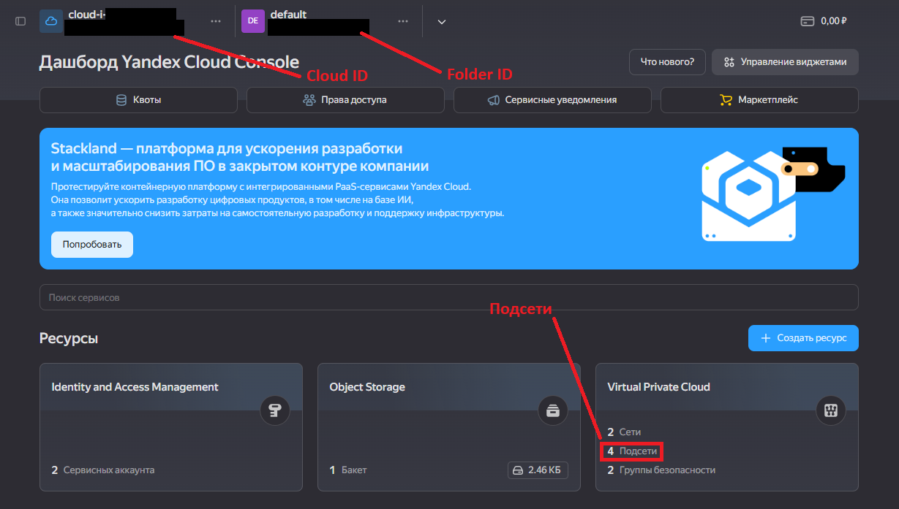

# Задание 1. Модульная инфраструктура для нескольких сред

Универсальный модуль `vm_module` позволяет создавать виртуальную машину с дополнительным диском в Yandex Cloud. Модуль параметризован и может использоваться для разных окружений (dev, stage, prod).

## Параметры модуля

| Переменная             | Описание                            | Тип         | По умолчанию             |
|------------------------|-------------------------------------|-------------|--------------------------|
| vm_name                | Имя виртуальной машины              | string      | vm_module                |
| cpu_count              | Количество ядер CPU                 | number      | 2                        |
| ram_size               | Объём RAM (ГБ)                      | number      | 2                        |
| additional_disk_size   | Размер дополнительного диска (ГБ)   | number      | 10                       |
| additional_disk_type   | Тип дополнительного диска           | string      | network-hdd              |
| subnet_id              | ID подсети                          | string      | -                        |
| ssh_username           | Имя пользователя                    | string      | ubuntu                   |
| ssh_key_path           | Путь к файлу с SSH ключом           | string      | ~/.ssh/id_rsa.pub        |
| image_family           | Семейство образа загрузочного диска | string      | Ubuntu 22.04             |
| zone                   | Зона доступности                    | string      | ru-central1-a            |
| boot_disk_size         | Размер загрузочного диска в ГБ      | number      | 20                       |
| boot_disk_type         | Тип загрузочного диска              | string      | network-hdd              |
| create_additional_disk | Создавать ли дополнительный диск    | bool        | false                    |
| attach_disk_id         | ID подключаемого диска              | string      | null                     |
| assign_public_ip       | Использовать ли публичный IP        | bool        | false                    |
| labels                 | Дополнительные метки ресурсов       | map(string) | {}                       |
| platform_id            | Идентификатор платформы             | string      | standard-v3              |

## Выходные значения

| Переменная           | Описание                          |
|----------------------|-----------------------------------|
| instance_id          | ID виртуальной машины             |
| instance_name        | Имя виртуальной машины            |
| external_ip          | Внешний IP-адрес                  |
| internal_ip          | Внутренний IP-адрес               |
| boot_disk_id         | ID загрузочного диска             |
| boot_disk_name       | Имя загрузочного диска            |
| additional_disk_id   | ID дополнительного диска          |
| additional_disk_name | Имя дополнительного диска         |

## Предварительные действия

1. Для решения проблемы с установкой модулей необходимо создать файл `.terraformrc` с прокси:

```conf
provider_installation {
  network_mirror {
    url = "https://terraform-mirror.yandexcloud.net/"
    include = ["registry.terraform.io/*/*"]
  }
  direct {
    exclude = ["registry.terraform.io/*/*"]
  }
}
```

2. Также необходимо добавить провайдер в файлы модуля и конфигурации:

```conf
terraform {
  required_providers {
    yandex = {
      source = "yandex-cloud/yandex"
    }
  }
  required_version = ">= 0.13"
}
```

3. Скопируйте файл terraform.tfvars.example в terraform.tfvars и заполните его актуальными значениями:

```bash
cp terraform.tfvars.example terraform.tfvars
```

## Где взять актуальные значения?

### yc_token

#### 1 Вариант
Выполнить команду:
```bash
yc iam create-token
```

#### 2 Вариант
Перейти по этой ссылке и получить токен для своего аккаунта:
[Ссылка](https://oauth.yandex.ru/authorize?response_type=token&client_id=1a6990aa636648e9b2ef855fa7bec2fb)

### yc_cloud_id

Выполнить команду:
```bash
yc config get cloud-id
```

### yc_folder_id
Выполнить команду:
```bash
yc config get folder-id
```

### subnet_id
Выполнить команду:
```bash
yc vpc subnet list
```

### Взять переменные из веб-интерфейса



## Создание сервисного аккаунта

1. Нажимаем на кнопку "Создать ресурс"
2. В поиске вводим "Сервисный аккаунт"
3. Выбираем сервисный аккаунт
4. На открывшейся странице нажимаем на кнопку "Создать сервисный аккаунт"
5. Заполняем форму и даем аккаунту необходимые роли

## Создание ключа

1. Заходим в созданный аккаунт
2. Нажимаем на кнопку "Создать статический ключ"
3. Заполняем форму
4.  Нажимаем на кнопку "Создать"
5. Сохраняем полученные значения Идентификатор ключа (AWS_ACCESS_KEY_ID) и Ваш секретный ключ (AWS_SECRET_ACCESS_KEY)

## Использование

1. Перейдите в директорию нужного окружения:
```bash
   cd envs/dev
```

2. Выполните инициализацию и применение:

```bash
terraform init
terraform plan
terraform apply
```

3. Для удаления ресурсов используйте:

```bash
terraform destroy
```