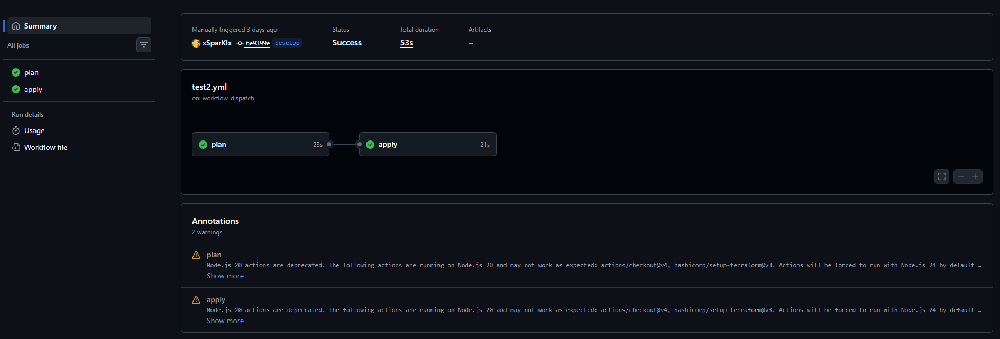

# Задание 2. Интеграция с CI/CD и удалённым хранением состояния

## Предварительные действия

1. Скопируйте файл terraform.tfvars.example в terraform.tfvars и заполните его актуальными значениями:

```bash
cp terraform.tfvars.example terraform.tfvars
```
> ! Информацию об актуальных значениях можно взять из [README.md](../Task1Advanced/README.md) в первом задании.

2. Дать сервисному аккаунту роль `storage.editor` (или можно создать новый сервисный аккаунт)

    1. На главной странице консоли заходим в "Identity and Access Management"
    2. Выбираем необходимый аккаунт
    3. В левом открывшемся меню выбираем "Права доступа"
    4. Нажимаем на кнопку "Назначить роли"
    5. В открывшейся форме выбираем на аккаунт
    6. Нажимаем на кнопку "Добавить роль"
    7. В открывшемся списке выбираем роль `storage -> editor`
    8. Нажимаем на кнопку "Сохранить"

## Создание бакета S3

### Через веб-интерфейс

1. Нажимаем на кнопку "Создать ресурс"
2. В поике вводим "Object Storage"
3. Выбираем "Бакет"
4. Заполняем конфигурацию и нажимаем "Создать бакет"
5. Заходим в созданный бакет
6. Нажимаем на кнопку "Создать папку"
7. Вводим имя папки
8. Нажимаем на кнопку "Создать"

### Через CLI

> Где брать актуальные значения можно посмотреть в [README.md](../Task1Advanced/README.md) первого задания

Выполняем команду:

```bash
export AWS_ACCESS_KEY_ID=*Идентификатор ключа*
export AWS_SECRET_ACCESS_KEY=*Ваш секретный ключ*
export AWS_DEFAULT_REGION=ru-central1

aws --endpoint-url=https://storage.yandexcloud.net s3api create-bucket \
  --bucket *Имя бакета* \
  --create-bucket-configuration LocationConstraint=ru-central1
```

## Добавление переменных workflows

1. Открываем репозиторий
2. Переходим в вкладку "Settings"
3. В левом меню раскрываем пункт "Secrets and variables"
4. В открывшемся списке выбираем "Actions"
5. Нажимаем на кнопку "New repository secret"
6. Заполняем открывшуюся форму
7. Нажимаем на кнопку "Add secret"
8. Повторяем так для каждого секрета

| Секрет | Описание |
| :--- | :---|
| AWS_ACCESS_KEY_ID | Идентификатор статического ключа |
| AWS_SECRET_ACCESS_KEY | Ваш секретный ключ |
| YC_CLOUD_ID | Уникальный идентификатор Вашего облака |
| YC_FOLDER_ID | Уникальный идентификатор Вашей папки |
| YC_TOKEN | Ваш IAM токен |

## Workflow

1. `Job plan` запускается автоматически при pull request в Task2Advanced/**, выполняет init и plan, показывает изменения в PR.
2. `Job apply` запускается только вручную через workflow_dispatch, применяет план с auto-approve.

> Все чувствительные данные передаются через GitHub Secrets.

## Использование

1. Выполните инициализацию и применение:

```bash
terraform init
terraform plan
terraform apply
```

2. Для удаления ресурсов используйте:

```bash
terraform destroy
```

## Результаты запуска Actions

